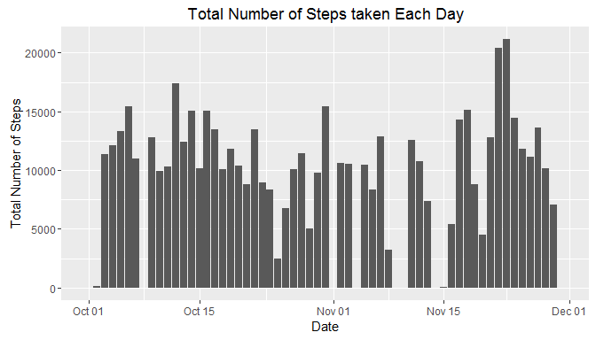
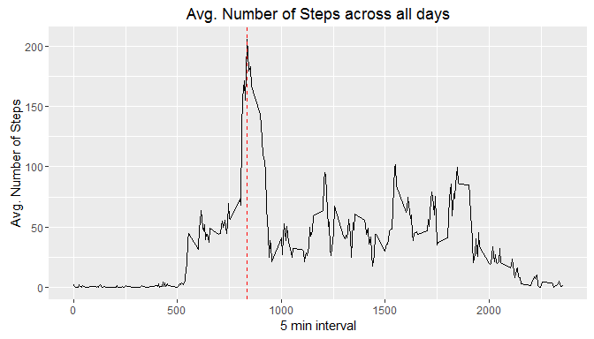
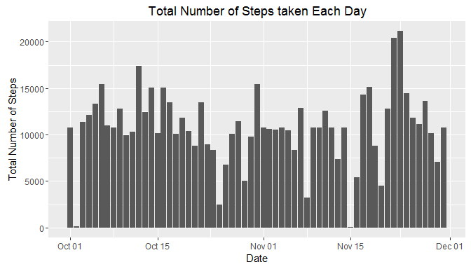
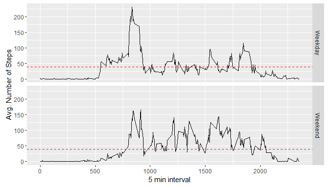

# Reproducible Research: Peer Assessment 1


## Loading and pre-processing the data
Steps involved:

* Install and load all necessary packages

* Loading the data from csv file

* Adding a new column to the data with date in "Date" format


```r
install.packages("plyr")
install.packages("dplyr")
install.packages("lubridate")
install.packages("ggplot2")
library(plyr)
library(dplyr)
library(lubridate)
library(ggplot2)
```

```r
data1 <- tbl_df(read.csv("activity.csv"))
data1 <- data1 %>% mutate(dt = ymd(as.character(date)))
```

## What is the total number of steps taken day?

1. Make a histogram of the total number of steps taken each day
Summarizing data by date on total number of steps


```r
data1_smry <- data1 %>% group_by(dt) %>% summarize(total.steps = sum(steps, na.rm = TRUE))
```


```r
g <- ggplot(data = data1_smry, aes(x = dt, y = total.steps)) 
g + geom_bar(stat = "identity") + xlab("Date") + ylab("Total Number of Steps") + ggtitle("Total Number of Steps taken Each Day")
```

<!-- -->

2. Calculate and report the mean and median total number of steps taken per day


```r
mn <- mean(data1_smry$total.steps, na.rm = TRUE)
md <- median(data1_smry$total.steps, na.rm = TRUE)
```
The mean of the total number of steps is 9354.2295082 and the median of the total number of steps in 10395.

## What is the average daily activity pattern?

1. Make a time series plot (i.e. type = "l") of the 5-minute interval (x-axis) and the average number of steps taken, averaged across all days (y-axis)


```r
data1_smry <- data1 %>% group_by(interval) %>% summarize(avg.steps = mean(steps, na.rm = TRUE))
```


```r
g <- ggplot(data = data1_smry, aes(x = interval, y = avg.steps)) 
g <- g + geom_line() + xlab("5 min interval") + ylab("Avg. Number of Steps") + ggtitle("Avg. Number of Steps across all days")
g + geom_vline(aes(xintercept=data1_smry[which.max(data1_smry$avg.steps),]$interval), linetype = "dashed", col = "Red")
```

<!-- -->

2. Which 5-minute interval, on average across all the days in the dataset, contains the maximum number of steps?


```r
fmi <- data1_smry[which.max(data1_smry$avg.steps),]$interval
```

The 5 minute interval which contains the maximum number of steps when averaged across all days is 835.

## Imputing missing values

1. Calculate and report the total number of missing values in the dataset (i.e. the total number of rows with NAs)


```r
mv <- sum(is.na(data1$steps))
```

The total number of missing values in steps column is 2304.

2. Devise a strategy for filling in all of the missing values in the dataset. The strategy does not need to be sophisticated. For example, you could use the mean/median for that day, or the mean for that 5-minute interval, etc.

The missing values of a particular 5 minute interval are replaced by the average value of that 5 minute interval across all days.

3. Create a new dataset that is equal to the original dataset but with the missing data filled in.


```r
data1 <- arrange(data1, dt, interval)
new_data <- data1
temp <- data1 %>% group_by(interval) %>% summarize(avg.steps = mean(steps, na.rm = TRUE))
new_data$steps[is.na(new_data$steps)] <- arrange(merge(x = new_data[is.na(new_data$steps), ], y = temp, by.x = "interval", by.y = "interval", all = TRUE), dt, interval)$avg.steps
```
4. Make a histogram of the total number of steps taken each day and Calculate and report the mean and median total number of steps taken per day.


```r
new_data_smry <- new_data %>% group_by(dt) %>% summarize(total.steps = sum(steps, na.rm = TRUE))
```


```r
g <- ggplot(data = new_data_smry, aes(x = dt, y = total.steps)) 
g + geom_bar(stat = "identity") + xlab("Date") + ylab("Total Number of Steps") + ggtitle("Total Number of Steps taken Each Day")
```

<!-- -->

Do these values differ from the estimates from the first part of the assignment? What is the impact of imputing missing data on the estimates of the total daily number of steps?


```r
mn2 <- mean(new_data_smry$total.steps)
md2 <- median(new_data_smry$total.steps)
```

The mean of the total number of steps is 1.0766189\times 10^{4} and the median of the total number of steps in 1.0766189\times 10^{4}. The mean has considerably increase while the median stayed almost similar.

## Are there differences in activity patterns between weekdays and weekends?

1. Create a new factor variable in the dataset with two levels - "weekday" and "weekend" indicating whether a given date is a weekday or weekend day.


```r
new_data <- new_data %>% mutate(wkday = weekdays(dt))
new_data$wkday[new_data$wkday == "Saturday" | new_data$wkday == "Sunday"] <- "Weekend"
new_data$wkday[!(new_data$wkday == "Weekend")] <- "Weekday"
new_data_smry <- new_data %>% group_by(wkday, interval) %>% summarize(avg.steps = mean(steps))
```

2. Make a panel plot containing a time series plot (i.e. type = "l") of the 5-minute interval (x-axis) and the average number of steps taken, averaged across all weekday days or weekend days (y-axis).


```r
g <- ggplot(new_data_smry, aes(x = interval, y = avg.steps)) + geom_line() + facet_grid(wkday~.)
g +  geom_hline(aes(yintercept=mean(new_data_smry$avg.steps)), linetype = "dashed", col = "Red") + xlab("5 min interval") + ylab("Avg. Number of Steps")
```

<!-- -->
